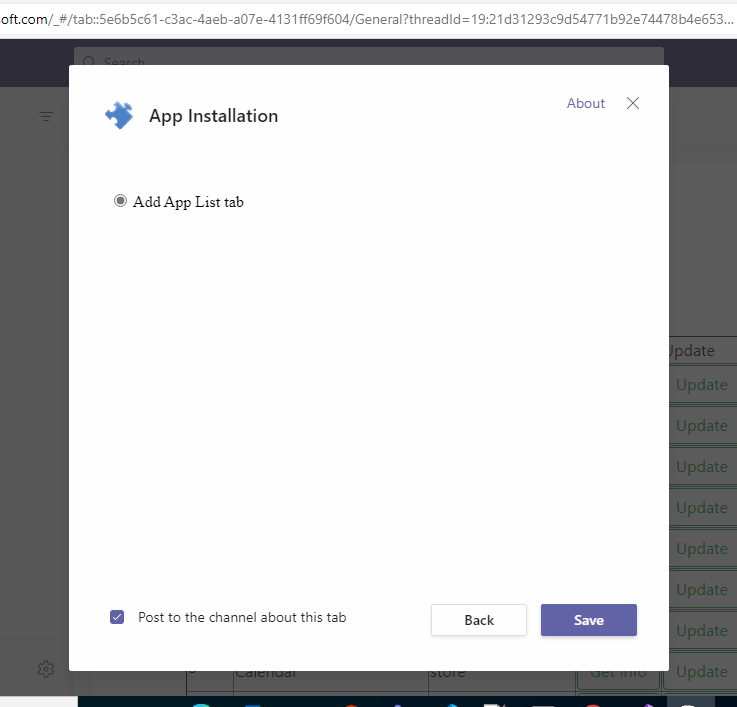
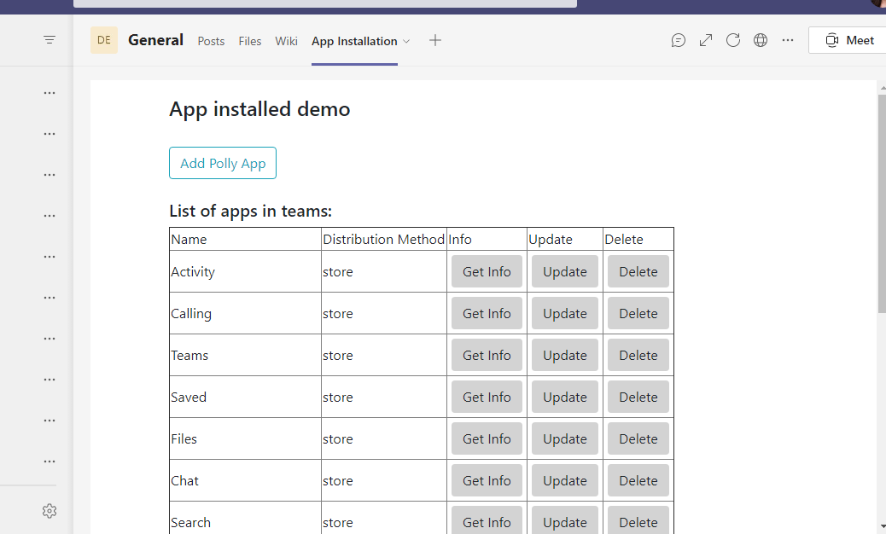
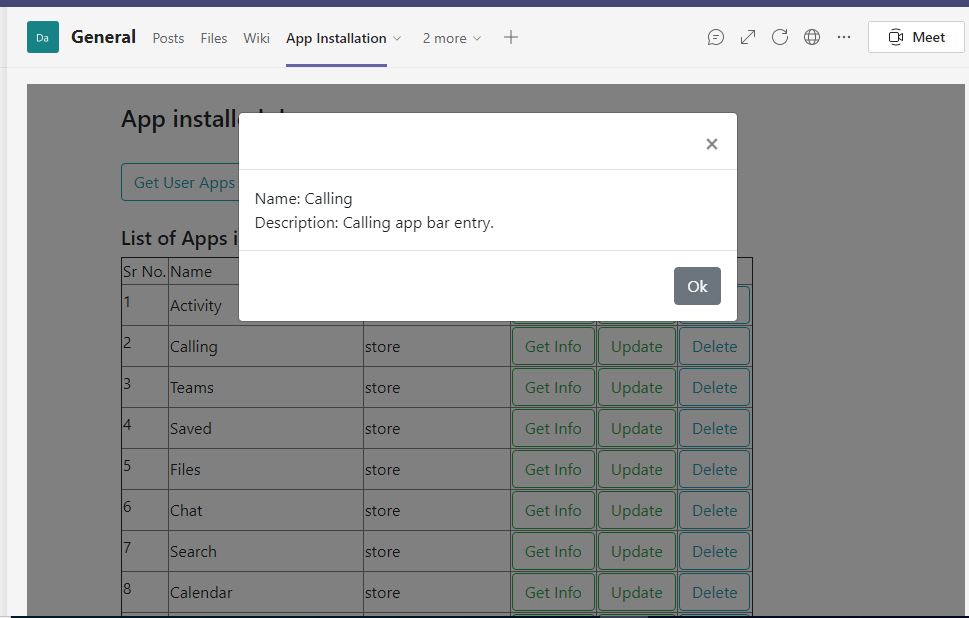
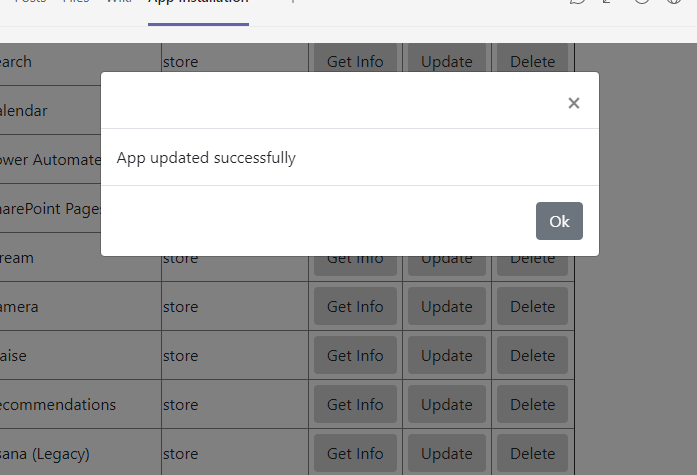
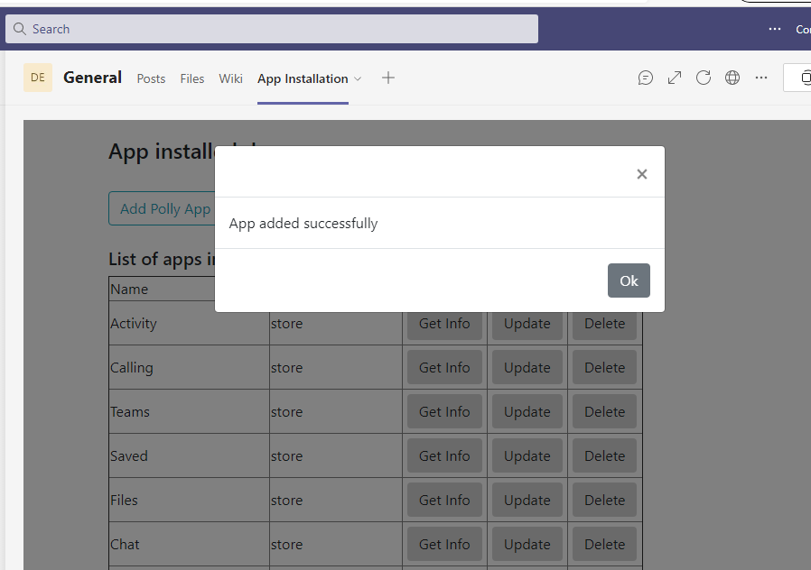
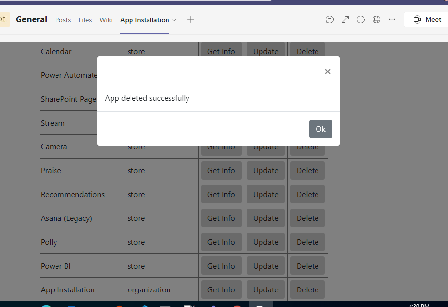

---

page_type: sample

description: This sample illustrates how you can use [Teams App Installation Life Cycle](https://docs.microsoft.com/en-us/graph/api/resources/teamsappinstallation?view=graph-rest-1.0) by calling Microsoft Graph APIs. .

products:
- office-teams
- office
- office-365

language(s):
- nodejs

extensions:

contentType: samples

createdDate: 16-11-2021 01:42:53

---
# App Installation

This sample app demonstarte the installation lifecycle for Teams [Apps](https://docs.microsoft.com/en-us/graph/api/resources/teamsappinstallation?view=graph-rest-1.0) which includes create, update delete Apps


## Prerequisites

- [NodeJS](https://nodejs.org/en/)
- [ngrok](https://ngrok.com/) or equivalent tunnelling solution

## To try this sample

1) Clone the repository

    ```bash
    git clone https://github.com/OfficeDev/Microsoft-Teams-Samples.git
    ```

1) In a terminal, navigate to `samples/graph-app-installation-lifecycle/nodejs
`

1) Install modules

    ```bash
    npm install
    ```

1) Run ngrok - point to port 3978

    ```bash
    ngrok http -host-header=rewrite 3978
    ```


1) Register your app with Microsoft identity platform via the Azure AD portal
    - Your app must be registered in the Azure AD portal to integrate with the Microsoft identity platform and call Microsoft Graph APIs. See [Register an application with the Microsoft identity platform](https://docs.microsoft.com/en-us/graph/auth-register-app-v2).
    - You need to add following permissions mentioned in the below screenshots to call respective Graph   API
 

1) Update the `.env` configuration with the ```ClientId``` and ```ClientSecret```

1) Run your bot at the command line:

    ```bash
    npm start
    ```

1) __*This step is specific to Teams.*__
    - **Edit** the `manifest.json` contained in the  `Manifest` folder to replace your Microsoft App Id (that was created when you registered your bot earlier) *everywhere* you see the place holder string `<<Manifest-id>>` (depending on the scenario the Microsoft App Id may occur multiple times in the `manifest.json`)and ngrok url *everywhere* you see the place holder string `<<base-URL>>`
    - **Zip** up the contents of the `Manifest` folder to create a `manifest.zip`
    - **Upload** the `manifest.zip` to Teams (in the Apps view click "Upload a custom app")

   


   


   


   


   


   
